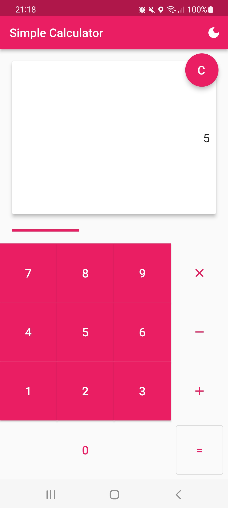
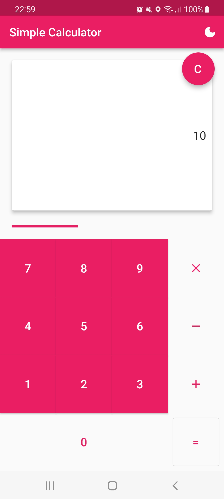
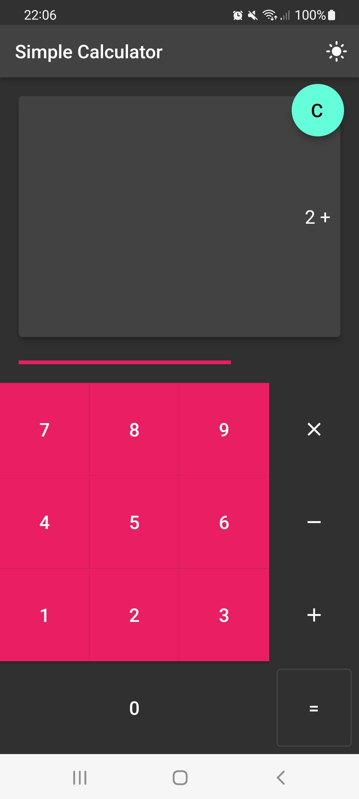

# Simple Calculator

This is a simple calculator using Flutter with light and dark mode.

  
  
  
  
  
  
  
  
  
  

# Supported State Management Solutions
  
- NONE
  
# Packages 

- NONE

# Future Roadmap

- N/A

